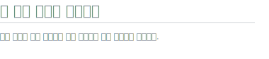
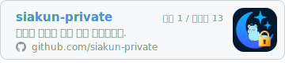
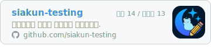
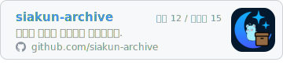
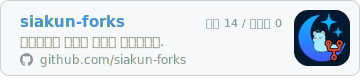

> “Everybody in this country should learn how to program a computer, because it teaches you how to think.”  - Steve Jobs, *The Lost Interview* (1995)

저에게 개발은 남은 평생 이어가고 싶은 일입니다. 설계에서 재미를, 구현에서 자신감을, 누군가에게 도움이 될 때 보람을 느낍니다. 그 과정에서 쌓은 경험을 GitHub에서 함께 나누고 싶습니다.

<!-- 2단 레이아웃: metrics와 카드 4장은 왼쪽 플로트, 헤더는 일반 인라인 +  .
     와이드: 헤더/카드가 metrics 오른쪽 열에 쌓임. 중간 폭: 헤더가 자기 행을 차지하고
     카드만 2열 격자. 모바일: 세로 스택. 헤더가 인라인인 이유: 플로트로 두면 격자에서
     카드와 같은 행에 끼고, raw 텍스트로 두면 좁은 폭에서 짜부라지기 때문.
      은 clear 없는 순수 줄바꿈이라 metrics 플로트에 영향이 없다. PROJECT.md 참고. -->

  
   
  
  
  
  

  

<!-- 기술 태그: scripts/gen-tech-tags.sh가 아래 구간을 생성한다. 손으로 편집하지 않는다.
       뒤라 위 플로트 레이아웃과 간섭이 없고, 뒤에 붙인  이
     위 섹션과의 세로 간격(빈 줄 하나)을 만든다. -->
<!-- tech-tags:start -->

<!-- tech-tags:end -->

<!--
## 📫 연락처

  
  

-->
