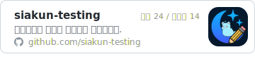
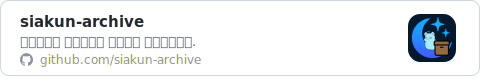
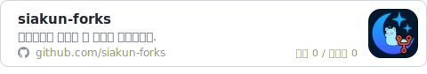

> “Everybody in this country should learn how to program a computer, because it teaches you how to think.”
> — Steve Jobs, *The Lost Interview* (1995)

저에게 개발은 남은 평생 이어가고 싶은 일입니다.
설계에서 재미를, 구현에서 자신감을, 누군가에게 도움이 될 때 보람을 느낍니다.
그 과정에서 쌓은 경험을 GitHub에서 함께 나누고 싶습니다.
<!--
---

## 🛠️ 주요 기술

  

---

## 🌱 학습 중

  

-->

  

---

## 🗂️ 다른 공간의 저장소들

작업 성격에 따라 저장소를 여러 조직으로 나눠 관리하고 있습니다.

   
   
   
  

<!--

---

## 📫 연락처

  
  

-->

